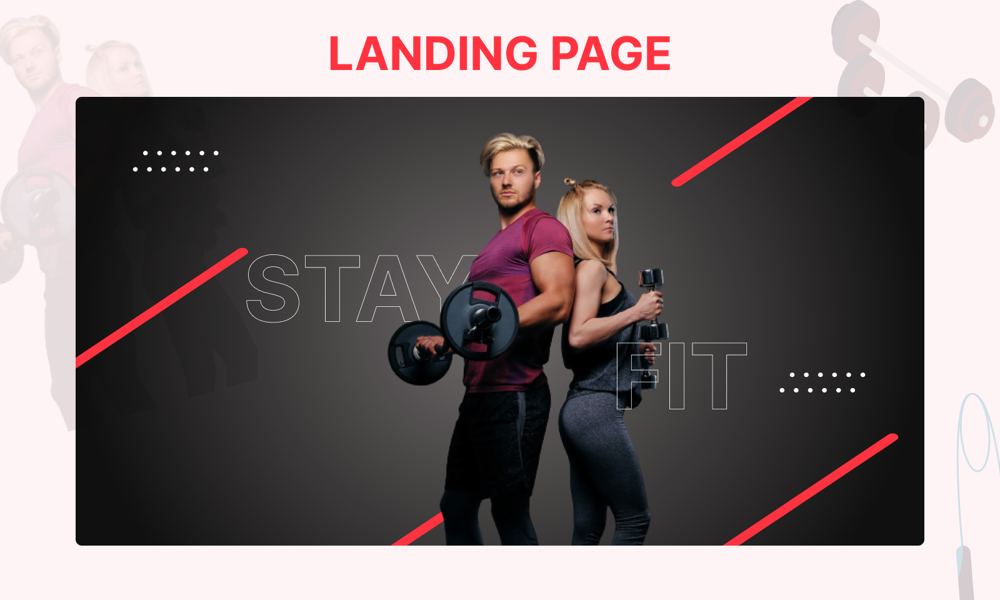

<div align="center">
  <br />

  <h1 align="center">Fitness</h1>
  <h2 align="center">Fitness Website landing page</h2>

Fitness is a fully responsive fitness website, <br />Responsive for all devices, build using HTML, CSS, and some JavaScript.

<a href="https://fitness-landing-page-task.netlify.app/"><strong>➥ See Live Demo</strong></a>

</div>

<br />

### Run Locally

To run **Fitness** locally, run this command on your terminal:

Command:

```bash
git clone https://github.com/nabeel-mustafa-git/fitness-landing-page-task.git
```

### Demo Screeshots



### Contact

If you want to contact with me you can reach me at [Linkedin](https://www.linkedin.com/in/nabeel-dev).
